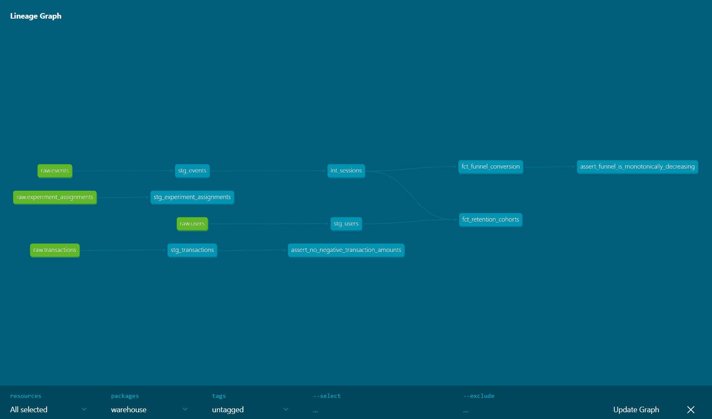
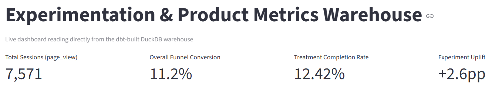
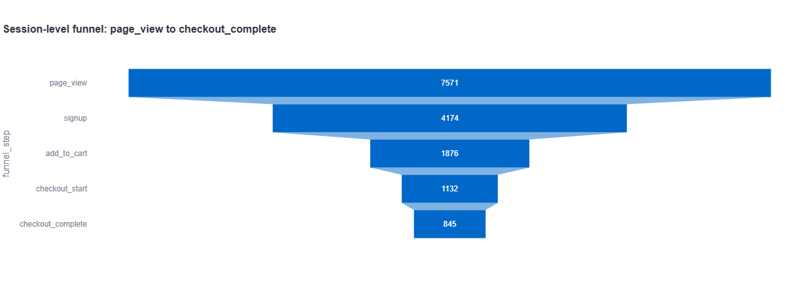
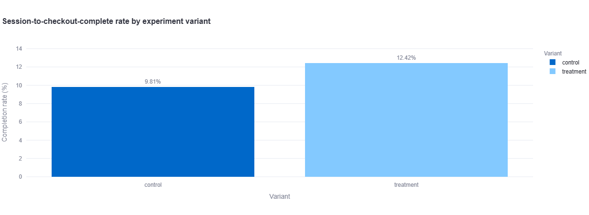

# Experimentation & Product Metrics Warehouse

A dbt-based analytics pipeline simulating 90 days of product activity for a fintech-style product, covering funnel conversion, weekly retention cohorts, and A/B experiment analysis.

## What this project does

Raw synthetic data (users, events, transactions, experiment assignments) is transformed through a staging -> intermediate -> marts pipeline into tested, documented business metrics:

- **Funnel conversion** - step-by-step drop-off across a 5-step product funnel
- **Retention cohorts** - weekly cohort retention percentages
- **Experiment analysis** - conversion uplift between A/B test variants

## Pipeline lineage



## Real results (from this pipeline's own data)

- Funnel: page_view -> signup -> add_to_cart -> checkout_start -> checkout_complete (7,571 -> 4,174 -> 1,876 -> 1,132 -> 845), 11.2% overall conversion
- Experiment: treatment group converted at 12.42% vs 9.81% for control (~2.6 percentage-point / ~27% relative uplift)
- 20 automated data-quality tests, correctly catching seeded data issues (orphaned events, negative transaction amounts)

## Dashboard





## Tech stack

- dbt-core + dbt-duckdb
- DuckDB (local, file-based warehouse)
- Python (Faker) for synthetic data generation

## Project structure

```
scripts/                  data generation + loading
warehouse/
  models/staging/         cleaned, typed, deduplicated sources
  models/intermediate/    sessionization logic
  models/marts/           funnel conversion, retention cohorts
  tests/                  custom singular tests
```

## How to run it

```bash
pip install dbt-core dbt-duckdb faker duckdb
python scripts/generate_data.py
python scripts/load_to_duckdb.py
cd warehouse
dbt build
dbt docs generate
dbt docs serve
```

Data generation uses a fixed random seed, so results are fully reproducible.
